## Fast Fourier Transform
by Paul Heckbert from Feb. 1995 &nbsp;&nbsp;&nbsp;[paper link](http://www.cs.cmu.edu/afs/andrew/scs/cs/15-463/2001/pub/www/notes/fourier/fourier.pdf)  
#### Definition of the Fourier Transform
The Fourier Transform of the function `f(x)` is `F(ω)` &nbsp;&nbsp;
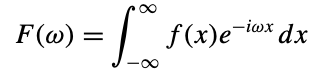
The inverse Fourier Transform is  &nbsp;&nbsp;
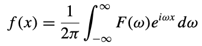  
`i` is an indeterminate with `i^2 = -1`, `e^(iθ) = cos(θ)+isin(θ)`  
**The Fourier transform uses complex exponentials (sinusoids) of various frequencies as its basis functions.**
#### Discrete Fourier Transform (DFT)
When a signal is discrete and periodic, we don’t need the continuous Fourier transform. Suppose our signal is `a_n` for `n` = 0...N−1, and `a_n = a_(n+jN)` for all `n` and `j`. The DFT of `a`, also known as the spectrum of `a`, is:
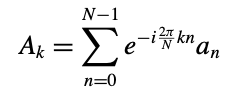 More commonly wriiten as: 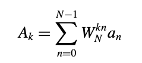 where 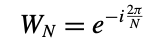  and 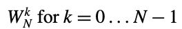  are called the **_Nth root of unity_**  

Below are roots of unity for N = 2, N = 4, and N = 8, graphed in the complex plane.  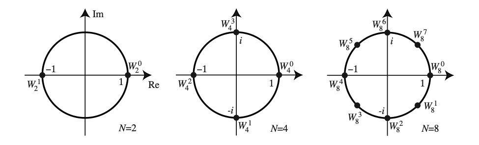  
The formula for the inverse DFT is: 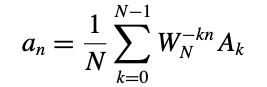

#### The Fast Fourier Transform (FFT) Algorithm
To compute the DFT of an N-point sequence using equation  would take **O(N^2)** multiplies and adds. The FFT computes the DFT using **O(NlogN)** multiplies and adds.  
Below is a diagram of an 8-point FFT, where 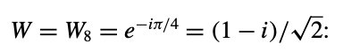 diagram as:  
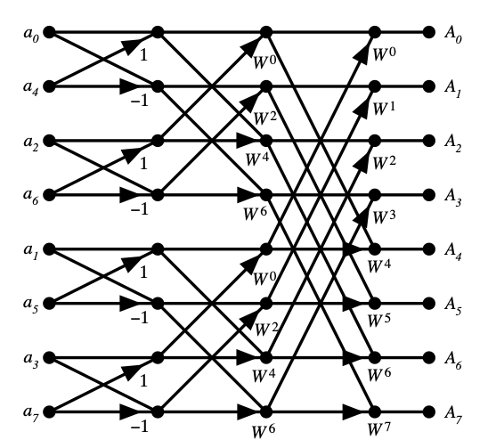  
**Butterflies and Bit-Reversal** The FFT algorithm decomposes the DFT into `log2N` stages, each of which consists of N/2 butterfly computations. Each butterfly takes two complex numbers p and q and computes from them two other numbers, `p + αq` and `p − αq`, where `α` is a complex number.  
In the diagram of the 8-point FFT above, note that the inputs aren’t in normal order: `a0, a1, a2, a3, a4, a5, a6, a7`, they’re in the bizarre order: `a0, a4, a2, a6, a1, a5, a3, a7`.  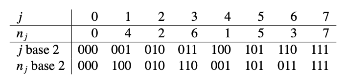 `nj` is the bit-reversal of `j`. The sequence is also related to breadth-first traversal of a binary tree.

#### FFT Explained Using Matrix Factorization
The 8-point DFT can be written as a matrix product:  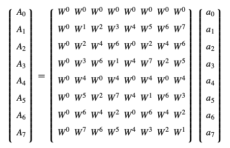  
Rearranging so that the input array a is bit-reversed and factoring the 8 × 8 matrix: 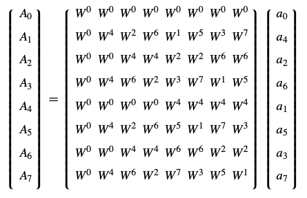  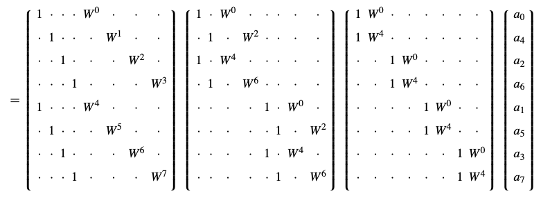

#### Why Would We Want to Compute Fourier Transforms
Because it is faster than traditional convolution algorithm.
If `h = f ⊙ g`, think f as the signal and g as the filter. The convolution theorem says that the Fourier transform of the convolution of two signals is the product of their Fourier transforms: `f ⊙ g ↔ FG`.
Computing the convolution with a straight forward algorithm would require `N^2` (real) multiplies and adds.  
Using **Fourier Convolution**:  

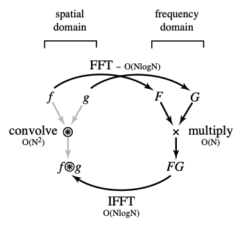  

#### Fourier Transforms of Images
The two-dimensional discrete Fourier transform is a simple generalization of the standard 1-D DFT: 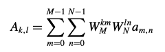
To compute the Fourier transform of an image:
- > Compute 1-D DFT of each row, in place.
- > Compute 1-D DFT of each column, in place.
For an `N × N` picture, `N` a power of 2, the cost of a 2-D FFT is proportional to `N^2log N`.
